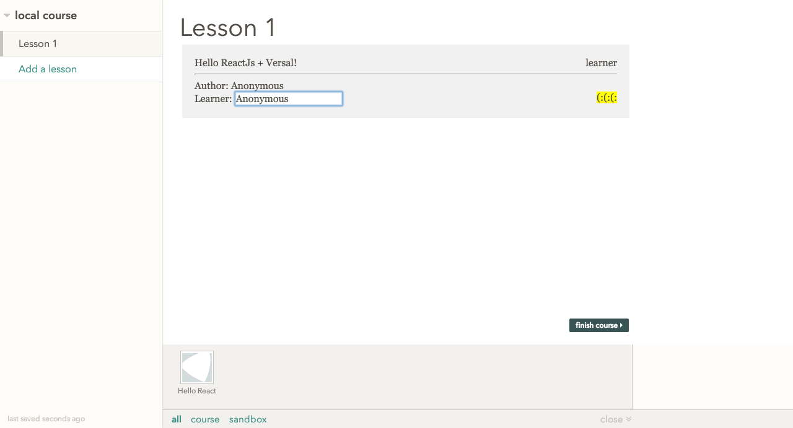
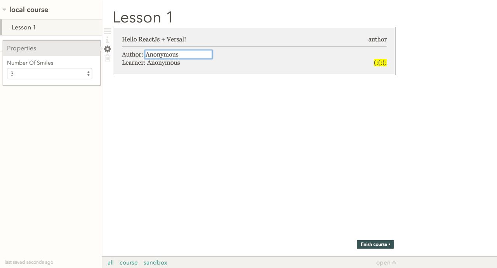

# React gadget template [](https://travis-ci.org/Versal/react-gadget-template)

## Summary

A hyper opinionated template for making [Versal](https://versal.com/gadgets) gadgets with [ReactJs](http://facebook.github.io/react/).

## Screenshots

### Default learning



### Default authoring



### Usage

#### Create a gadget from the template

Clone the repo and reinitialize the git history

```
git clone https://github.com/Versal/react-gadget-template.git hello-react
cd hello-react
rm -r .git
git init
```

Optionally create a new repo on github and push to it

```
git remote add origin git@github.com:username/repo.git
git push origin master -u
```

#### Install prerequisites

*Note: On linux you'll need `g++` which is available through `build-essential` package on debian based distros.*

```
npm install --global gulp
npm install --global jshint
npm install --global nightwatch
```

## Install dependencies

This will build the dependencies and run the unit tests also

```
npm install
```

## Build everything

```
gulp
```

## Run unit tests

```
gulp test
```

## Run demos

Start the `versal preview` command and run selenium test suite against it

```
gulp demo
```

Any arguments are passed to `nightwatch`. For example if you want to run a single group of tests

```
gulp demo --group sanity
```

## Generate screenshots

This tasks runs the demos and pulls out the screenshots for use in the README (see above). This should be run often and the resulting files in `./screenshots` should be committed.

```
gulp screenshots
```

Screenshots you want to pull out can be declared in the `screenshots` key of `package.json`. See the top of [`scripts/screenshots.js`](scripts/screenshots.js) for more details.
